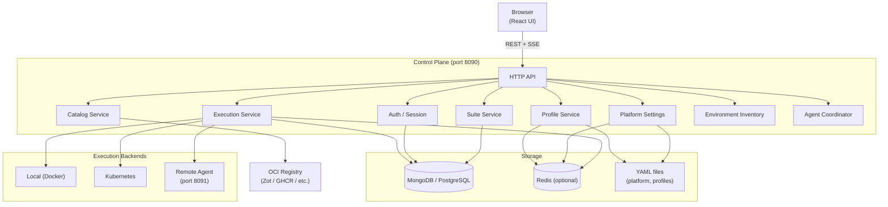
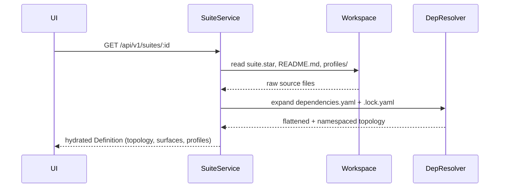
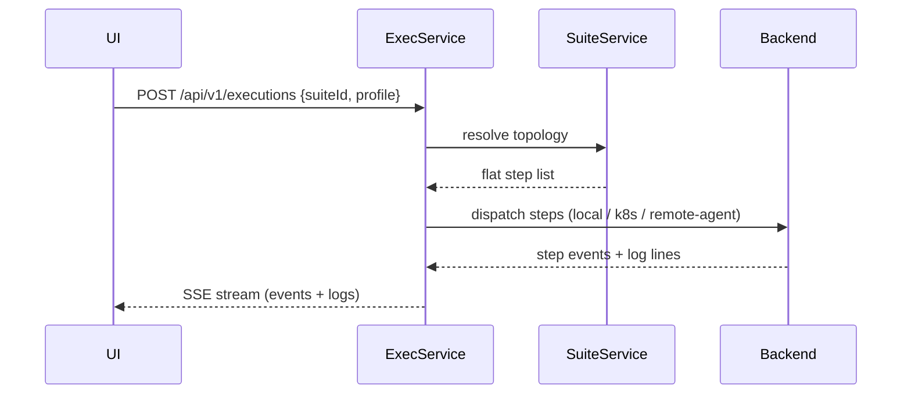
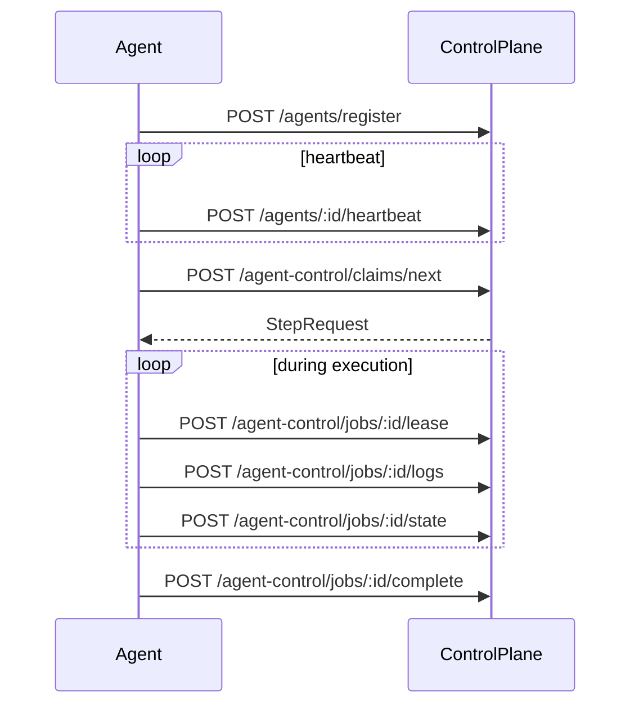

# Architecture

[Back to index](index.md)

## High-Level Shape

BabelSuite is split into four main layers:

1. **Frontend** — React UI for catalog, suites, profiles, executions, environments, and settings
2. **Control plane** — HTTP API server: auth, platform settings, profiles, catalog, suite resolution, execution orchestration
3. **Execution backends** — local Docker, Kubernetes, or remote agent
4. **Runtime infrastructure** — primary datastore, optional cache, telemetry pipeline, Docker



## Control Plane Composition

The control plane is assembled in:

- `backend/cmd/server/main.go`
- `backend/cmd/server/app.go`
- `backend/cmd/server/health.go`

The server wires together:

- authentication
- suite loading
- profile management
- catalog discovery
- execution orchestration
- environment inventory
- platform settings
- agent registry and assignment coordination
- telemetry, request middleware, and readiness probes

## Data Flows

### Suite resolution flow



### Execution launch flow



### Remote worker flow



## Main Backend Domains

| Package | Responsibility |
|---------|---------------|
| `internal/auth` | Local auth, session handling, OIDC login, JWT issuance |
| `internal/platform` | Agents, registries, secrets, platform settings |
| `internal/catalog` | Registry discovery and catalog package views |
| `internal/suites` | Suite loading, topology resolution, nested suite expansion |
| `internal/profiles` | Suite profile CRUD and validation |
| `internal/execution` | Launch, orchestration, runtime state, SSE streams |
| `internal/agent` | Worker registry, coordinator, worker control APIs |
| `internal/sandbox` | Environment inventory and cleanup APIs |
| `internal/httpserver` | Middleware: request IDs, audit hooks, tracing context |
| `internal/store` | Datastore and cache abstractions (MongoDB, PostgreSQL, Redis) |

## Frontend Surface

The React app currently exposes:

- home dashboard
- catalog browser
- suites explorer
- profiles manager
- live execution page
- environments page
- settings pages for general, agents, registries, and secrets
- local auth and SSO callback pages

## Storage Model

### Primary store

The control plane uses either:

- MongoDB (default)
- PostgreSQL

Configured via `DB_DRIVER` environment variable.

### Cache layer

Redis is optional and accelerates:

- cached reads for platform settings, profiles, and catalog
- execution runtime state
- coordination fast paths

The primary store remains the authority for persisted application state.

### File-backed state

Platform settings and managed profiles are stored in YAML files on disk:

- `configuration.yaml` — agents, registries, secrets
- `babelsuite-profiles.yaml` — managed profile records

Both are optionally cached in Redis.

## Middleware Stack

The server wraps all API traffic with shared middleware in this order:

```
CORS → Request IDs → Auth Session → OTel Trace → HTTP Metrics → Audit
```

This keeps system-wide concerns centralized rather than re-implemented in each handler.

For full middleware details, see [Control Plane Reference](control-plane.md).
